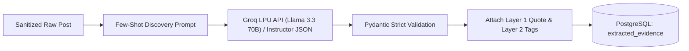
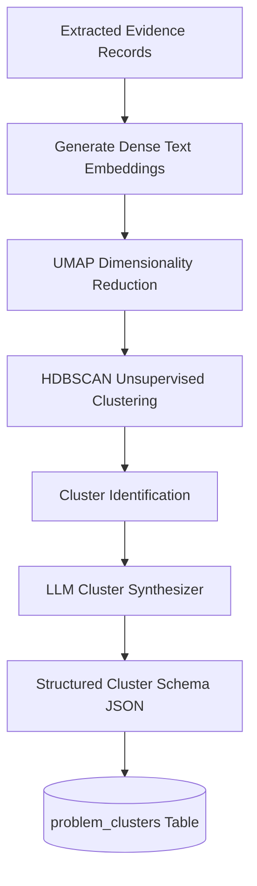
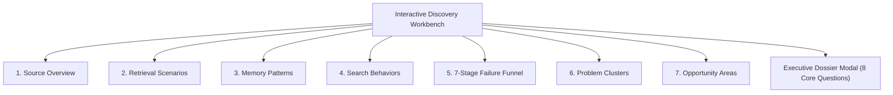

# Phase-Wise Implementation Plan: AI-Powered Discovery Engine for Google Photos Retrieval

> **Document Version:** 1.0.0  
> **Status:** Execution-Ready  
> **Governing Documents:**  
> - [Problem statement.md](file:///c:/Users/ADMIN/Desktop/PRODUCT%20OWNER%20PROJECT%203/AI%20Discovery%20Engine/Problem%20statement.md)  
> - [Architecture.md](file:///c:/Users/ADMIN/Desktop/PRODUCT%20OWNER%20PROJECT%203/AI%20Discovery%20Engine/Architecture.md)  
> **Core Mandate:** Pure discovery and qualitative-to-quantitative synthesis. No premature solution engineering.

---

## 1. Implementation Roadmap Overview

The execution roadmap is structured into **8 sequential, iterative phases**. Each phase produces a verifiable milestone, ensuring epistemic integrity, automated data flow, and strict compliance with the discovery framework.

```mermaid
gantt
    title AI Discovery Engine Execution Timeline
    dateFormat  YYYY-MM-DD
    section Foundations
    Phase 0: Environment & Core Schemas           :p0, 2026-10-01, 4d
    section Ingestion
    Phase 1: Multi-Source Harvesters & PII Gate   :p1, after p0, 7d
    section AI Engine
    Phase 2: 7-Dimension LLM Extraction Engine    :p2, after p1, 6d
    Phase 3: Semantic Vector Clustering Engine     :p3, after p2, 6d
    section Analytics & API
    Phase 4: Hypothesis Testing & 7-Stage Funnel  :p4, after p3, 5d
    Phase 5: High-Performance FastAPI Services   :p5, after p4, 5d
    section UI & Polish
    Phase 6: 7-Dashboard Interactive Workbench   :p6, after p5, 8d
    Phase 7: Epistemic Audit, Testing & Rollout   :p7, after p6, 4d
```

---

## Phase 0: Project Setup, Schemas & Infrastructure Foundations

### Objective
Establish the repository structure, Dockerized infrastructure (PostgreSQL, Qdrant, Redis), deterministic Pydantic schemas, and configuration management.

### Detailed Tasks
1. **Repository & Directory Structure Initialization:**
   - Create monorepo/modular layout:
     ```
     AI Discovery Engine/
     ├── backend/
     │   ├── app/
     │   │   ├── api/          # FastAPI routers
     │   │   ├── core/         # Config, logging, security
     │   │   ├── harvesters/   # Channel scrapers & connectors
     │   │   ├── extraction/   # LLM extraction & prompt chains
     │   │   ├── clustering/   # Vector embedding & HDBSCAN
     │   │   ├── analytics/    # Funnel & hypothesis testing
     │   │   ├── models/       # Pydantic schemas & SQLAlchemy ORM
     │   │   └── services/     # Business logic & repository layer
     │   ├── tests/
     │   ├── requirements.txt
     │   └── Dockerfile
     ├── frontend/
     │   ├── src/
     │   │   ├── components/   # UI widgets, cards, charts
     │   │   ├── dashboards/   # 7 distinct dashboard views
     │   │   ├── hooks/        # Data fetching & state
     │   │   └── types/        # TypeScript interfaces
     │   ├── package.json
     │   └── Dockerfile
     ├── docker-compose.yml
     └── .env.example
     ```
2. **Environment & Secrets Management:**
   - Configure `.env` supporting Groq API configuration (`GROQ_API_KEY`, `GROQ_MODEL_EXTRACTION=llama-3.3-70b-versatile`, `GROQ_MODEL_FAST_FILTER=llama-3.1-8b-instant`), database credentials, and scraping limits.
   - Install core backend dependencies: `groq`, `instructor`, `fastapi`, `pydantic`, `sqlalchemy`, `qdrant-client`, `celery`, `redis`.
3. **Database Schema & Migrations:**
   - Implement SQLAlchemy ORM models matching Section 4 of [Architecture.md](file:///c:/Users/ADMIN/Desktop/PRODUCT%20OWNER%20PROJECT%203/AI%20Discovery%20Engine/Architecture.md) (`raw_posts`, `extracted_evidence`, `problem_clusters`, `opportunity_areas`).
   - Setup Alembic migrations.
4. **Vector Store Setup:**
   - Configure Qdrant collection `photos_retrieval_evidence` with payload indices.

### Deliverables & Verification
- `docker-compose up` cleanly launches PostgreSQL, Redis, and Qdrant.
- Healthcheck scripts verify connectivity and schema migrations.

---

## Phase 1: Multi-Source Harvesters & Preprocessing Pipeline

### Objective
Build robust, rate-limited public scrapers and API adapters with deduplication, PII sanitization, and relevance gating.

### Detailed Tasks
1. **Channel Adapters Implementation:**
   - **Reddit Adapter:** Pull posts/comments from `r/googlephotos`, `r/Google`, `r/photography` via Reddit API / PRAW.
   - **Google Play Store Adapter:** Scrape reviews using `google-play-scraper` filtering by keywords: *"search"*, *"find"*, *"missing"*, *"scroll"*, *"album"*, *"years ago"*.
   - **Apple App Store Adapter:** Scrape reviews using `app-store-scraper`.
   - **Google Photos Community & YouTube Adapters:** Headless public thread ingestor with polite rate-limiting.
2. **Asynchronous Ingestion Workers (Celery / Redis):**
   - Job queue with exponential backoff and randomized jitter.
3. **Data Hygiene & Preprocessing:**
   - `SHA-256` deduplication on `(normalized_text, source_channel, post_date)`.
   - Automated PII maskers (regex + spaCy NER for names, phone numbers, emails).
4. **Noise & Relevance Gate (Groq LPU Filter):**
   - High-throughput binary relevance classifier using Groq `llama-3.1-8b-instant` (~800–1200 tokens/sec) discarding irrelevant noise (e.g., payment bugs, basic crash logs) at sub-100ms speeds.
   - Posts scoring $\ge 0.70$ are flagged `PENDING_EXTRACTION`.

### Deliverables & Verification
- At least 1,000 sanitized, deduplicated public posts stored in `raw_posts`.
- Zero PII leaks in raw text inspection.

---

## Phase 2: 7-Dimensional LLM Extraction Engine

### Objective
Implement the core intelligence pipeline converting unstructured user text into structured, auditable evidence records across the 7 mandatory discovery dimensions.



### Detailed Tasks
1. **Structured Output Schemas (Instructor / Pydantic):**
   - Implement `ExtractedEvidenceRecord` covering:
     1. `scenario_type` (old family, childhood, travel, document, screenshot, etc.)
     2. `remembered_clues` (people, relationships, activities, setting, objects, emotion)
     3. `forgotten_metadata` (exact date, location, person name, album, filename)
     4. `search_behaviors` (face search, place search, timeline scroll, query iterations)
     5. `failure_point` (recall deficit, query translation, semantic mismatch, clutter)
     6. `workarounds` (external chat, relatives, manual chronological search)
     7. `user_outcome` (success, high effort, manual browse, abandoned)
2. **Groq + Instructor Integration & Few-Shot Prompt Engineering:**
   - Initialize `instructor.from_groq(Groq(api_key=os.environ["GROQ_API_KEY"]))` targeting `llama-3.3-70b-versatile`.
   - Curate 5 gold-standard public posts demonstrating accurate parsing.
   - System prompt strictly instructs the LLM **not** to hallucinate missing data and to flag unknown fields as `None` or `Unknown`.
3. **Dynamic Category Discovery & Rate Limiting:**
   - Prompt allows LLM to suggest new emergent categories for memory clues and scenarios without breaking schema validation.
   - Implement exponential backoff and rate-limit handling for Groq RPM/TPM thresholds.
4. **Epistemic Traceability Enforcement:**
   - Mandatory persistence of `verbatim_quote`, `canonical_url`, and `ai_interpretation_notes`.

### Deliverables & Verification
- Unit test suite testing 50 synthetic and edge-case posts with $100\%$ schema pass rate.
- Verified database population of `extracted_evidence` with Layer 1 and Layer 2 isolation.

---

## Phase 3: Semantic Embedding & Problem Clustering Engine

### Objective
Group fragmented retrieval breakdowns across disparate sources into cohesive, empirical problem clusters without introducing human bias or arbitrary metrics.



### Detailed Tasks
1. **Composite Feature Vectorization:**
   - Concatenate scenario, failure point, remembered clues, and forgotten metadata into dense semantic strings.
   - Generate embeddings using `text-embedding-3-large` or `sentence-transformers/all-mpnet-base-v2`.
   - Store vectors in Qdrant with payload filters.
2. **Density-Based Clustering (HDBSCAN):**
   - Apply UMAP dimensionality reduction preserving local and global manifold structure.
   - Run HDBSCAN to find natural clusters of retrieval failure modes.
3. **Cluster Synthesis & Exemplar Extraction (Groq LPU Synthesis):**
   - Calculate cluster centroids; extract 5 nearest real-world exemplars per cluster.
   - Execute cluster synthesis using Groq `llama-3.3-70b-versatile` to produce: `problem_name`, `description`, `frequency`, `severity_indicators`, `retrieval_impact`, `common_user_behavior`, `common_workaround`.
4. **No Arbitrary Scoring Guardrail:**
   - Ensure severity is derived directly from empirical metrics (e.g., abandonment frequency, negative emotion markers, time spent).

### Deliverables & Verification
- Populated `problem_clusters` table with cross-source representation (e.g., Reddit + Play Store).
- Direct traceability linking each cluster back to verified user quotes.

---

## Phase 4: Hypothesis Testing & 7-Stage Funnel Analytics

### Objective
Statistically test the central research hypothesis and calculate drop-off metrics along the 7-stage retrieval journey.

### Detailed Tasks
1. **7-Stage Funnel Modeling:**
   - Model the user journey:
     $$\text{Memory} \rightarrow \text{Query Formulation} \rightarrow \text{Search Execution} \rightarrow \text{Results Display} \rightarrow \text{Refinement} \rightarrow \text{Recognition} \rightarrow \text{Retrieval}$$
   - Map each `failure_point` to its corresponding funnel stage.
   - Compute stage transition probabilities and total attrition.
2. **Empirical Mismatch Hypothesis Testing:**
   - Build a contingency table comparing:
     - **Natural Episodic Cues:** Activities, people, emotional context, ambient setting.
     - **Missing Indexing Metadata:** Exact year/date, exact GPS, filenames, formal tags.
   - Calculate Chi-Square test of independence and Cramér’s V to quantify the discrepancy between human memory encoding and system indexing requirements.
3. **Analytics Aggregation Engine:**
   - Precompute aggregation views for instant API querying.

### Deliverables & Verification
- Statistical report confirming or refuting the mismatch hypothesis with p-values and confidence intervals.
- Funnel metric calculations ready for Dashboard 5 visualization.

---

## Phase 5: High-Performance Backend API Services (FastAPI)

### Objective
Expose clean, performant, and secure REST endpoints powering all 7 views of the PM Research Workbench.

### Detailed Tasks
1. **API Endpoints Architecture:**
   - `/api/v1/overview`: Aggregated sources, total count, platform breakdown, date range (Dashboard 1).
   - `/api/v1/scenarios`: Scenario frequency distribution and difficulty cross-tabs (Dashboard 2).
   - `/api/v1/memory-patterns`: Co-occurrence matrix and correlation metrics (Dashboard 3).
   - `/api/v1/search-behaviors`: Behavior frequency, sankey flow data, transitions (Dashboard 4).
   - `/api/v1/failure-funnel`: 7-stage dropout metrics and failure stage distributions (Dashboard 5).
   - `/api/v1/clusters`: Problem clusters list, details, exemplar quotes, multi-source links (Dashboard 6).
   - `/api/v1/opportunities`: Derived opportunity areas, primary research questions (Dashboard 7).
   - `/api/v1/evidence`: Paginated, filterable evidence records with 1-click URL drill-downs.
   - `/api/v1/executive-summary`: 8-question executive discovery synthesis.
2. **Caching & Optimization:**
   - Redis caching for expensive analytical aggregations ($TTL = 1\text{ hour}$).
   - Sub-150ms response times for all analytical endpoints.

### Deliverables & Verification
- Interactive OpenAPI / Swagger documentation (`/docs`).
- Full automated test coverage with `pytest` for all endpoints.

---

## Phase 6: Interactive 7-Dashboard Workbench (Frontend)

### Objective
Build a modern, responsive, and dynamic web application providing Product Managers with deep discovery insights across 7 dedicated analytical dashboards.



### Detailed Tasks

#### 1. Dashboard 1 — Source Overview
- Ingestion metrics cards (total posts, platforms covered, active channels).
- Platform distribution donut chart (Play Store, App Store, Reddit, Help Community).
- Ingestion timeline and verifiable source table with clickable canonical URLs.

#### 2. Dashboard 2 — Retrieval Scenarios
- Scenario prevalence bar chart (childhood, documents, family, travel, screenshots).
- Cross-tabulation matrix: Photo scenario vs. Retrieval outcome.
- Filter by scenario to isolate specific user segments.

#### 3. Dashboard 3 — Memory Patterns
- Co-occurrence heatmap: What users naturally remember vs. What they forget.
- Memory clue taxonomy breakdown (Activities, Settings, People, Objects, Emotion).
- Verbatim quote preview on hover.

#### 4. Dashboard 4 — Search Behavior
- Sankey diagram showing flow: Initial Search Action $\rightarrow$ Search Result $\rightarrow$ Secondary Workaround $\rightarrow$ Outcome.
- Tactics frequency chart (face tag, location search, timeline scrolling, asking kin).

#### 5. Dashboard 5 — 7-Stage Retrieval Failure Map
- Interactive Funnel visualization illustrating attrition across the 7 stages.
- Clickable stages opening a drawer of relevant user quotes and failure mechanics.

#### 6. Dashboard 6 — Problem Clusters
- Interactive card grid of discovered clusters with severity and frequency indicators.
- Source radar chart showing multi-source presence for each cluster.
- Evidence drawer displaying raw user excerpts, dates, and URLs.

#### 7. Dashboard 7 — Opportunity Areas & Executive Synthesis
- Opportunity Prioritization Matrix: User Evidence Volume vs. Severity Impact.
- Formulated primary research questions for PMs to run in follow-up user interviews.
- Exportable **Executive Discovery Dossier** answering the 8 core discovery questions.

### Deliverables & Verification
- Fully functional, highly responsive Next.js/React frontend.
- Zero broken links; all evidence cards link directly to raw public sources.

---

## Phase 7: Epistemic Audit, Testing & Rollout

### Objective
Conduct rigorous end-to-end testing, hallucination audits, performance benchmarking, and final packaging.

### Detailed Tasks
1. **Epistemic Traceability Audit:**
   - Sample 100 random claims, clusters, and statistics; verify that each links to an authentic raw post and verified URL.
   - Verify that AI interpretations are never masqueraded as direct user quotes.
2. **Load & Stress Testing:**
   - Test dashboard under concurrent user queries with Locust.
   - Ensure caching maintains $<200\text{ ms}$ latency.
3. **Discovery Boundary Audit:**
   - Review all UI text, cluster summaries, and opportunity descriptions to confirm that no prescriptive final solutions or UI designs are generated prematurely.
4. **Documentation & Packaging:**
   - Complete operational README, deployment guides, and PM User Guide.

### Deliverables & Verification
- Final Epistemic Audit Report signed off.
- One-click launch via Docker Compose.

---

## Summary of Implementation Milestones

| Milestone | Target Phase | Core Deliverable | Acceptance Criteria |
| :--- | :--- | :--- | :--- |
| **M1: Foundations Ready** | Phase 0 | Dockerized DBs & ORM | All containers healthy, migrations applied |
| **M2: Data Flowing** | Phase 1 | Multi-channel scrapers | $\ge 1,000$ sanitized posts in PostgreSQL |
| **M3: Extraction Active** | Phase 2 | 7-Dimension LLM Engine | $100\%$ schema pass rate on evidence |
| **M4: Clusters Discovered**| Phase 3 | Semantic HDBSCAN Engine | Multi-source clusters synthesized |
| **M5: Funnel & API Live** | Phase 4 & 5 | 7-Stage Funnel & REST API | All 7 dashboard endpoints operational |
| **M6: UI Workbench Live** | Phase 6 | 7 Interactive Dashboards | Full interactive PM UI with evidence drilldown |
| **M7: Certified Discovery**| Phase 7 | Final Audit & Executive Dossier| $100\%$ traceable claims; 8 questions answered |
