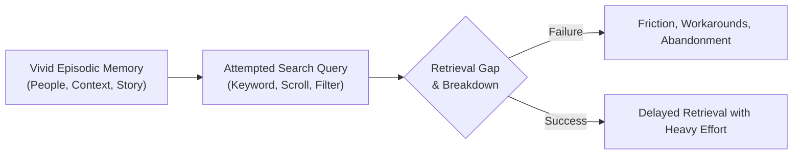
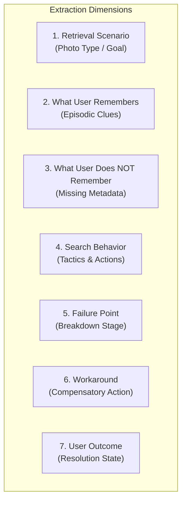
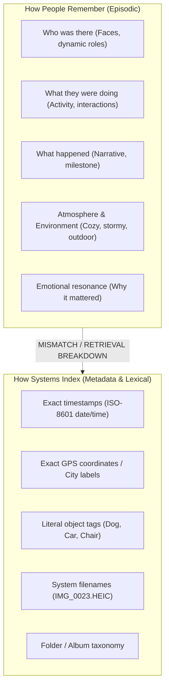
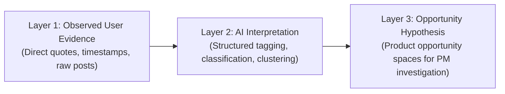

# Problem Statement: AI-Powered Discovery Engine for Google Photos Retrieval

> **Status:** Active Discovery Specification  
> **Core Mandate:** This is a **discovery problem**, not a solution-generation problem. Do NOT propose or jump to a final product solution prematurely.

---

## 1. Context & Background

Google Photos users accumulate thousands of photos, videos, screenshots, and documents over several years. When users want to retrieve an old or difficult-to-find photo, they often possess vivid episodic memories (they remember that the photo exists and remember specific impressions), but they frequently lack exact indexing metadata such as:
- Exact date or timestamp
- Exact GPS location or address
- Specific album name or folder structure
- Original filename
- Precise system-friendly search keywords

### Core Discovery Goal
To systematically understand **how people naturally remember and retrieve difficult-to-find photos**, and uncover precisely **where and why the retrieval journey breaks down**.



---

## 2. Objective & AI Inference Runtime

Build an **AI-powered Discovery Engine** that analyzes publicly available user conversations and complaints about Google Photos retrieval at scale.

The engine must go significantly beyond basic sentiment analysis or generic text summarization:
1. **Evidence-Driven Extraction:** Parse unstructured user discussions into structured dimensions of human memory and search failure.
2. **Cross-Source Clustering:** Identify, compare, and cluster different photo-retrieval problems and opportunity areas using concrete evidence from real users.
3. **Hypothesis Validation:** Test whether modern photo retrieval architectures fundamentally clash with human episodic recall.

### AI Inference Runtime (Groq API)
To analyze thousands of long qualitative user discussions at real-time speeds with deterministic structured outputs, the Discovery Engine is powered by the **Groq API** (utilizing Language Processing Units - LPUs):
* **Core Extraction & Synthesis Engine:** `llama-3.3-70b-versatile` hosted on Groq for nuanced qualitative reasoning, structured JSON extraction, and cross-source cluster synthesis.
* **High-Speed Relevance & Noise Filter:** `llama-3.1-8b-instant` on Groq for ultra-low latency, high-throughput binary gating of incoming scraped reviews.
* **Benefits:** Sub-second latency per record, deterministic JSON schema compliance, and cost-effective scaling across thousands of public user threads.

---

## 3. Data Sources & Ingestion Scope

Analyze publicly available discussions prioritizing sources where users describe an **actual retrieval experience, specific difficulty, workaround, or failed search**:

| Source Channel | Target Content & Signals |
| :--- | :--- |
| **Google Play Store Reviews** | User reviews detailing search failures, updates breaking search, usability friction. |
| **Apple App Store Reviews** | iOS Google Photos app reviews detailing search limitations and UX bugs. |
| **Reddit** | Subreddits such as `r/googlephotos`, `r/Google`, `r/photography`, `r/techsupport`. |
| **Google Photos Help Community** | Support threads, troubleshooting queries, unresolved retrieval questions. |
| **YouTube Comments** | Comments under tutorials, feature announcements, and product reviews. |
| **Public Forums & Tech Boards** | XDA Developers, Stack Exchange, specialized forums. |
| **Social Media Discussions** | Public posts and threads discussing photo discovery and archival issues. |

---

## 4. Multi-Dimensional Extraction Schema (What the AI Must Extract)

For every identified user conversation or review, extract the following 7 dimensions:



### 1. Retrieval Scenario
What photo or artifact is the user trying to locate?
* Old family photo
* Childhood photo
* Travel / vacation photo
* Photo with a specific person or relationship
* Event / milestone photo (weddings, birthdays, graduations)
* Food / dining photo
* Screenshot (receipts, chat logs, flight info)
* Document / paper record (ID, medical record, contracts)
* Nature / scenery photo
* *AI-discovered emerging scenario types*

### 2. What the User Remembers (Episodic & Experiential Clues)
What information does the user naturally express when describing the memory?
* **People:** Faces, relationships, group dynamics (e.g., "me and my college roommate").
* **Relationships:** Contextual ties without official names.
* **Activities:** What people were doing (e.g., "blowing candles", "hiking in the rain").
* **Events:** Personal occasions or milestones.
* **Places or Settings:** Sensory/ambient descriptions (e.g., "a cozy wooden cabin", "by the beach at sunset").
* **Objects:** Specific items present (e.g., "red sweater", "blue mug", "vintage car").
* **Visual Appearance:** Colors, lighting, composition, perspective.
* **Approximate Time:** Relative timeframes (e.g., "sophomore year", "roughly 5 summers ago").
* **Story / Context:** The narrative behind the moment.
* **Emotion / Significance:** Feelings associated with the moment (e.g., "hilarious accident", "emotional farewell").
* **Sequence of Events:** Temporal order (e.g., "right after lunch before we caught the train").
* *Note: The AI must actively discover and surface new memory categories from raw data.*

### 3. What the User Does NOT Remember (Missing / Inaccessible Data)
Missing or uncertain parameters that traditional databases rely upon:
* Exact date or timestamp
* Exact geolocation or address
* Person's full/tagged name
* Formal event title
* Album name or organizational tag
* Exact camera filename (e.g., `IMG_2041.jpg`)
* System-compatible search keywords

### 4. Search Behavior
Observable actions the user takes in their attempt to find the photo:
* Searches by person / face tag
* Searches by location / geo-tag
* Searches by event name
* Searches by object or activity keyword
* Employs natural-language descriptive queries (e.g., "dog playing in snow 2018")
* Scrolls the infinite timeline chronologically
* Opens and inspects multiple albums
* Tries multiple query iterations and synonyms
* Switches to another application (e.g., Apple Photos, WhatsApp, Drive)
* Asks friends/family members to send the photo
* Abandons the search / gives up
* Other novel behavioral patterns

### 5. Retrieval Failure Point
Pinpointing the precise stage where the retrieval journey breaks:
* **Recall Deficit:** Cannot recall enough distinct attributes.
* **Query Translation Gap:** Cannot express the episodic memory into concise search terms.
* **Directional Paralysis:** Does not know what keyword to even start with.
* **Semantic Mismatch:** Engine misinterprets user intent (literal matches vs contextual intent).
* **Information Overload:** Query returns thousands of photos with no relevance ranking.
* **Zero or Irrelevant Results:** Search returns inaccurate or completely unrelated images.
* **Recognition Difficulty:** Thumbnail or grid view makes it hard to identify the target image.
* **Refinement Impasse:** System offers no intuitive levers to filter or narrow failed results.
* **Cognitive Fatigue:** Search requires too much manual inspection and effort.

### 6. Workarounds
Compensatory behaviors deployed when native search fails (e.g., checking external chat backups, external cloud drives, asking relatives, manual chronological brute-force scrolling).

### 7. User Outcome
Classification of final resolution state:
* `Successfully retrieved`
* `Retrieved after multiple attempts / high effort`
* `Retrieved through manual browsing (timeline scroll)`
* `Retrieved using another method / external source`
* `Could not retrieve (abandoned)`
* `Outcome unknown`

---

## 5. Cross-Source Analysis & Clustering Framework

After extracting individual conversations, synthesize and cluster them into distinct, evidence-backed retrieval problem clusters.

### Cluster Schema Specification

For each problem cluster, document the following schema:

```json
{
  "cluster_id": "string",
  "problem_name": "string",
  "description": "Comprehensive explanation of the retrieval breakdown",
  "frequency": "Relative and absolute volume across analyzed dataset",
  "severity_indicators": "Impact on user frustration, time lost, cognitive burden",
  "retrieval_impact": "Direct effect on success rate and abandonment",
  "common_user_behavior": ["Observed tactics and search patterns"],
  "common_workaround": ["Compensatory steps taken by users"],
  "sources_present": ["PlayStore", "Reddit", "HelpCommunity", "..."],
  "representative_evidence": [
    {
      "source": "Reddit",
      "url": "https://...",
      "date": "YYYY-MM-DD",
      "quote": "Exact user statement excerpt"
    }
  ],
  "potential_opportunity_area": "Hypothesis for product enhancement"
}
```

> [!CAUTION]
> **No Arbitrary Scoring:** Do not assign arbitrary numerical severity or priority scores without empirical grounding in user evidence, recurrence counts, and documented abandonment rates.

---

## 6. Core Research Question & Central Hypothesis

### Research Question
Is there a structural mismatch between **how human memory encodes a photo** versus **how photo retrieval systems expect users to query for it**?



### Hypothesis to Validate
Users naturally retain rich contextual, narrative, and experiential signals while lacking precision around metadata (exact dates, locations, filenames, formal keywords).

> [!IMPORTANT]
> Treat this as an **empirical hypothesis to validate or refute with user data**, never as a predetermined conclusion.

---

## 7. Required Output: 7 Interactive Dashboards

The engine must present its findings across seven dedicated analytical views:


### Dashboard 1 — Source Overview
* Total volume of public sources analyzed
* Total count of verified retrieval conversations
* Distribution across platforms (Play Store, App Store, Reddit, Help Community, etc.)
* Temporal date range of analyzed evidence
* Verifiable source links and provenance tracking

### Dashboard 2 — Retrieval Scenarios
* Frequency breakdown of photo types (childhood, documents, travel, receipts, events)
* Cross-tabulation of photo types against retrieval difficulty

### Dashboard 3 — Memory Patterns
* Frequency matrix of what users remember vs. what they forget
* Correlations between remembered cues (e.g., emotion + setting) and missing data (exact year)

### Dashboard 4 — Search Behavior
* Distribution of primary and secondary search tactics
* Transition paths between strategies (e.g., search query $\rightarrow$ failed $\rightarrow$ manual scroll $\rightarrow$ give up)

### Dashboard 5 — Retrieval Failure Map
Visualization of breakdown points across the full 7-stage retrieval journey:
$$\text{Memory} \longrightarrow \text{Query Formulation} \longrightarrow \text{Search Execution} \longrightarrow \text{Results Display} \longrightarrow \text{Query Refinement} \longrightarrow \text{Visual Recognition} \longrightarrow \text{Retrieval}$$

### Dashboard 6 — Problem Clusters
* Synthesis of recurring retrieval problems
* Multi-source evidence backing each cluster
* Severity and frequency comparative view

### Dashboard 7 — Opportunity Areas
* Structured product opportunity spaces derived strictly from the strongest clusters
* Explicit separation of validated pain points from speculative concepts
* *Note: Does NOT propose final UI or technical solutions.*

---

## 8. Evidence Requirements & Epistemic Traceability

Every finding, chart, and insight generated by the engine must provide direct lineage back to the raw user evidence.

### Evidence Data Unit Schema
For every evidence data point stored:
* `source`: Platform origin (e.g., Reddit, Play Store)
* `url`: Direct canonical URL
* `date`: Publication date (if available)
* `user_statement`: Verbatim excerpt from user text
* `extracted_scenario`: Classified photo scenario
* `extracted_memory_clues`: Parsed memory elements
* `missing_information`: Identified absent parameters
* `search_behavior`: Actions taken
* `failure_point`: Classified failure stage
* `cluster`: Assigned problem cluster

### Epistemic Separation Standard
The engine must strictly maintain clear boundaries across three analytical layers:



> [!WARNING]
> Never present an AI inference or classification as if it were a direct user quote. Traceability must be auditable at all times.

---

## 9. Final Research Output & PM Framework

The engine culminates in an Executive Synthesis structured around eight core discovery questions:

1. **Photo Vulnerability:** What kinds of photos are hardest to retrieve?
2. **Natural Memory Cues:** What information do users naturally remember?
3. **Information Deficits:** What information do users commonly lack?
4. **Behavior Under Incomplete Memory:** How do users search when memory is incomplete?
5. **Primary Breakdown Points:** Where does retrieval most frequently break down?
6. **Workaround Ecosystem:** What compensatory actions do users take?
7. **Cross-Source Consistency:** Which retrieval problems appear consistently across disparate channels?
8. **Validation Priorities:** Which opportunity areas deserve further validation through primary research?

### The Product Manager Progression
The Discovery Engine empowers product leaders to transition systematically:

$$\mathbf{Public\ User\ Evidence} \longrightarrow \mathbf{Retrieval\ Behavior} \longrightarrow \mathbf{Problem\ Clusters} \longrightarrow \mathbf{Opportunity\ Areas} \longrightarrow \mathbf{Primary\ Research\ Questions}$$

> [!IMPORTANT]
> The engine is strictly a **discovery system**. Do not generate final implementation solutions, feature specs, or wireframes unless explicitly requested.
